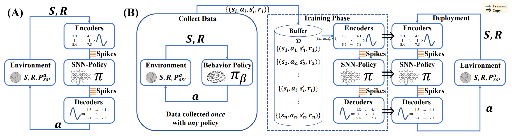

# ACSF-SNN

PyTorch implementation of "A Low Latency Adaptive Coding Spike Framework for Deep Reinforcement Learning" (ACSF) IJCAI2023. If you use our code or data please cite the [paper](<https://www.ijcai.org/proceedings/2023/0340>).

## Abstract

In recent years, spiking neural networks (SNNs) have been used in reinforcement learning (RL) due to their low power consumption and event-driven features. However, spiking reinforcement learning (SRL), which suffers from fixed coding methods, still faces the problems of high latency and poor versatility. In this paper, we use learnable matrix multiplication to encode and decode spikes, improving the flexibility of the coders and thus reducing latency. Meanwhile, we train the SNNs using the direct training method and use two different structures for online and offline RL algorithms, which gives our model a wider range of applications. Extensive experiments have revealed that our method achieves optimal performance with ultra-low latency (as low as 0.8% of other SRL methods) and excellent energy efficiency (up to 5X the DNNs) in different algorithms and different environments.



## Dependences

``` Bash
pip install -r requirements.txt
```

## Usage

If you are interested in reproducing some of the results from the paper, behavioral policy need to be trained by running:

```Bash
python main.py --train_behavioral --mode=DDPG
python main.py --train_behavioral --mode=TD3
```

Then you need to generate the buffers by running:

```Bash
python main.py --generate_buffer --mode=DDPG
python main.py --generate_buffer --mode=TD3
```

Finally you can train the ACSF by running:

```Bash
python main.py --mode=AEAD --buffer=DDPG
python main.py --mode=AEAD --buffer=TD3
```

If you want to try some ablation experiments, you can use the pre-define scripts. You need to copy the scipt to root and run:

```Bash
bash TrainAC_TimeSteps.sh
bash TrainAC_SpikingBaseline.sh
```

To test the trained model, please refer to tools, and run:

```Bash
python TestModel.py --env=Ant-v3 --mode=AEAD
```

If you want to watch the video, run:

```Bash
python tools/Video.py --env=Ant-v3 --buffer=TD3
```

## Citation

``` Bash
@inproceedings{ijcai2023p0340,
  title     = {A Low Latency Adaptive Coding Spike Framework for Deep Reinforcement Learning},
  author    = {Qin, Lang and Yan, Rui and Tang, Huajin},
  booktitle = {Proceedings of the Thirty-Second International Joint Conference on
               Artificial Intelligence, {IJCAI-23}},
  publisher = {International Joint Conferences on Artificial Intelligence Organization},
  editor    = {Edith Elkind},
  pages     = {3049--3057},
  year      = {2023},
  month     = {8},
  note      = {Main Track},
  doi       = {10.24963/ijcai.2023/340},
  url       = {https://doi.org/10.24963/ijcai.2023/340},
}
